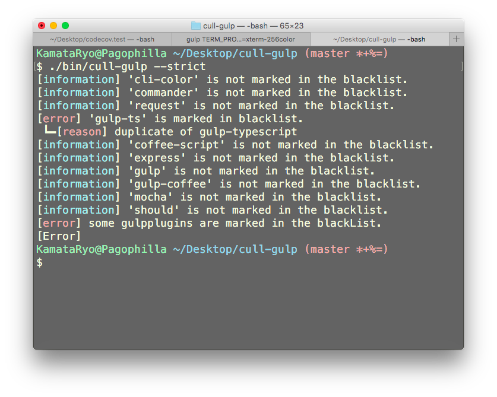

# cull-gulp

[](https://travis-ci.org/KamataRyo/cull-gulp)
[](https://badge.fury.io/js/cull-gulp)


This package checks gulpplugins which is marked in [blacklist](http://gulpjs.com/plugins/blackList.json).




## what for?

- simplify your developmental environment.
- save time to select gulpplugins when setting your project up.

## install

### for your project

```
$ npm install --save-dev cull-gulp
```

### or in global

```
$ npm install -g cull-gulp
```

## Usage Example

### examine a specific local node project

```
$ cull-gulp --path=path/to/project/root

[information] 'gulp-foo' is not marked in the blacklist.
[information] 'gulp-bar' is not marked in the blacklist.
[information] 'gulp-baz' is not marked in the blacklist.
[ok] No gulpplugins marked in the blackList found.
```

### without arguments

```
$ cull-gulp # refers current directory
```

### examine a specific module name

```
$ cull-gulp --module=gulp-foo2

[warn] 'gulp-foo2' is marked in blacklist.
 ┗━[reason] duplicate of gulp-foo
```

### options

`--strict` raises error.
See `$ cull-gulp --help` for the others.

## usage

### with package.json

You can stop `npm test` if some plugins are marked as blacklist.

```
{
    scripts: {
        "pretest": "set -e; ./node_modules/.bin/cull-gulp --strict --quiet",
        "test": "# do test"
    }
}
```

### inside .travis.yml

You can stop CI if some plugins are marked as blacklist

```
before_script:
  - "npm install -g cull-gulp"
script:
  - "set -e"
  - "cull-gulp --strict"
  - "npm test"
```
